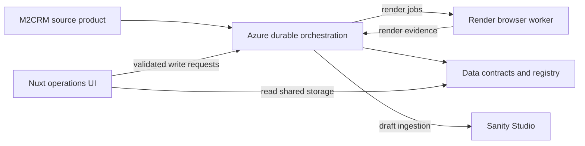

# Architecture

The enrichment pipeline preserves M2CRM commercial identity while collecting vendor evidence and producing recoverable, reviewable Sanity product content. This folder records stable cross-repository ownership and protocols; repository documentation owns concrete commands and implementation detail.

## System Model

Read these documents in order when changing a cross-repository feature:

- [Pipeline and durability](pipeline-and-durability.md): stage progression, durable state, recovery, and retry boundaries.
- [Identity and contracts](identity-and-contracts.md): Data-first contracts and product identity invariants.
- [Evidence and extraction](evidence-and-extraction.md): capture outputs, bounded storage, and extraction behavior.
- [Sanity and operator workflows](sanity-and-operator-workflows.md): bridge and publish gates, editorial workflows, and registry synchronization.
- [Extension boundaries](extension-boundaries.md): vendor-module policy and the deferred vendor/trade flow design.

## Durable Stages

1. `source_render`
2. `source_extract`
3. `variant_render`
4. `variant_extract`
5. `image_classify`
6. `compose`
7. `publish`

## Ownership

| Repository | Architectural responsibility |
| --- | --- |
| Data | Shared schemas, storage keys, registry data, and canonical project documentation. |
| Azure | Durable queue, ledger, extraction, recovery, composition, and draft-ingestion orchestration. |
| Render | Stateless Fastify/Playwright capture and deterministic vendor-specific browser behavior. |
| UI | Read-oriented Nuxt operations interface and validated server-side forwarding of write requests. |
| Studio | Sanity schema, editorial workflow, Studio UX, and Blueprint functions. |

The dependency order is Data, Azure, Render, UI, then Studio. A consumer must not invent a shared schema locally when Data owns the contract.
