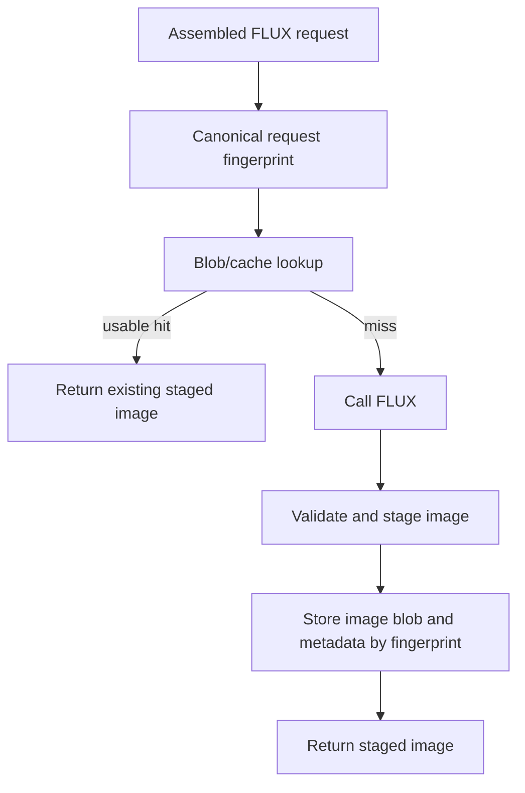

# FLUX Prompt Response Caching

Status: future design, not approved for implementation.

## Intent

Avoid duplicate billable FLUX image requests when the same image-generation request has already produced a usable image. A request should be able to derive a stable fingerprint, look up the corresponding blob, and reuse the saved image when the complete generation contract is equivalent.

This direction concerns response reuse only. It does not change the FLUX provider transport, prompt ownership, scene design, or final image persistence workflow.

## Proposed flow

1. Build the final FLUX request from the exact prompt and provider-relevant generation parameters.
2. Canonicalize the request deterministically and compute a SHA-256 fingerprint.
3. Check the fingerprint index/blob location before making a provider request.
4. On a valid hit, return the existing image reference without calling FLUX.
5. On a miss, call FLUX, validate the returned image, write the blob and metadata, and return the staged image reference.

## Fingerprint inputs

The fingerprint must represent every value that can change the generated image. At minimum it should include:

- the complete final FLUX prompt, byte-for-byte after final assembly;
- model/deployment identity and model version;
- output aspect ratio and resolved width/height;
- image count and output format;
- reference-image identities and their order, when image conditioning is used;
- reference-image strength and other provider generation controls;
- seed when explicitly supplied;
- prompt or scene-generation version;
- any provider-specific safety or quality parameters that affect generation.

Do not fingerprint only the scene prompt or product identity. A camera-policy change, reference image change, output dimension change, or provider parameter change must create a different cache key.

Canonicalization must use a stable structured representation with sorted object keys and explicit omission/null rules. The implementation should expose the canonical input used for the hash in bounded diagnostics without logging prompts, image bytes, credentials, or sensitive source content.

## Blob and metadata shape

The authoritative image bytes should live in Blob Storage. A metadata record should map the fingerprint to the staged image and retain only the execution information needed for reuse and recovery, such as:

- schema version;
- request fingerprint;
- model/deployment identity;
- output format and dimensions;
- blob container and path;
- byte length and image SHA-256;
- created and last-accessed timestamps;
- provider operation identity, when available;
- cache status and validation version.

The image fingerprint and blob content hash serve different purposes. The request fingerprint identifies the generation inputs; the content hash validates the stored artifact and detects corruption or accidental replacement.

## Correctness and recovery

A cache hit is valid only when the metadata validates and the blob can be read and decoded. Missing, malformed, corrupt, or incompatible entries must be treated as misses, not as successful image results.

Concurrent misses must converge. Multiple workers may call FLUX for the same fingerprint unless the implementation adds a durable claim or idempotent write barrier. A later writer must not overwrite a valid artifact with an incompatible response.

The cache write must be idempotent. If the provider succeeds but the metadata write fails, recovery must be able to retry the metadata write or safely regenerate without producing an ambiguous reusable entry.

Do not delete a reusable cache entry merely because run-content cleanup removes the active execution journal. The cache is a reusable artifact with its own retention and invalidation policy.

## Retention and invalidation

Before implementation, decide:

- whether entries are immutable or can be replaced by a newer generation version;
- how long images are retained and who owns cleanup;
- whether the cache is scoped by product, template, project, or environment;
- how provider/model changes invalidate old entries;
- whether editorial changes to a room, product, colour-design, texture, camera, scene, or brand brief naturally invalidate through the prompt fingerprint;
- how failed, filtered, partial, or manually rejected images are excluded from reuse.

A generated image must never be reused across environments or authorization boundaries unless the cache scope explicitly allows it.

## Trigger for implementation

Implement this direction when FLUX generation is stable enough that duplicate-request savings can be measured and the durable blob owner, retention period, cache scope, and concurrent-miss policy have been approved. The implementation plan must define the canonical fingerprint schema, blob key, metadata store, validation path, cleanup/recovery behavior, and focused tests before adding a cache lookup to the live image workflow.
